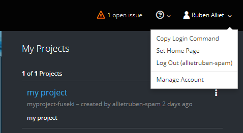

# How to deploy an application on Openshift

## Step 1: Login/register on Openshift
First make sure that you're registered on openshift.
Visit [this](https://manage.openshift.com/) website to login to openshift.  

You can use the free tier subscription or the payed subscribtion. 
now click on the right top of the page where the username is displayed.



Now paste the login command to your terminal/command prompt.
The command should look something like this:

```
oc login https://api.starter-ca-central-1.openshift.com --token=0wjddpyDNNfhsK_8cLCaiC6oKvy50B0medcPvGRXb8k
```

## Step 2: Select a project or make a new project to deploy your application in

After you login to your account you will get a list of projects that you can switch between

Use this command to select a project:
```
oc project <project-name>
```

If you do not have any existing projects, you can create one:
```
oc new-project <project-name>
```

To show a high level overview of the current project:
```
oc status
```

## Step 3: Deploy your application

All base images can be find on [Redhat](https://access.redhat.com/containers/)

### a.Dotnet CORE 2.0 (C#)

Enter the following command in your terminal to create your dotnet Core application.
Replace the git repo with yours and specify the name of your application:

```
$ oc new-app --name=myapp registry.access.redhat.com/dotnet/dotnet-20-rhel7~https://github.com/openshift-evangelists/dotnet-core-2.0-example.git
```

Your output should look like this when the application was created sucesfully:

```
$ oc status
In project my project (myproject-fuseki) on server https://api.starter-ca-central-1.openshift.com:443

svc/dotnet-core-20-example - 172.30.166.111:8080
  dc/dotnet-core-20-example deploys istag/dotnet-core-20-example:latest <-
    bc/dotnet-core-20-example source builds https://github.com/openshift-evangelists/dotnet-core-2.0-example.git on istag/dotnet-20-rhel7:latest
    deployment #1 deployed 3 minutes ago - 1 pod

View details with 'oc describe <resource>/<name>' or list everything with 'oc get all'.
```  

### b.Nodejs (JavaScript)


Enter the following command in your terminal to create your NodeJS application. Replace the git repo with yours and specify the name of your application:

```
oc new-app --name=pillar-base nodejs~http://github.com/OpenShiftDemos/pillar-base
``` 

The output should look something like this:

```
--> Found image 6f7f7d9 (5 weeks old) in image stream "nodejs" in project "openshift" under tag "0.10" for "nodejs"

    Node.js 0.10 
    ------------ 
    Platform for building and running Node.js 0.10 applications

    Tags: builder, nodejs, nodejs010

    * A source build using source code from http://github.com/OpenShiftDemos/pillar-base will be created
      * The resulting image will be pushed to image stream "pillar-base:latest"
    * This image will be deployed in deployment config "pillar-base"
    * Port 8080/tcp will be load balanced by service "pillar-base"
      * Other containers can access this service through the hostname "pillar-base"

--> Creating resources with label app=pillar-base ...
    imagestream "pillar-base" created
    buildconfig "pillar-base" created
    deploymentconfig "pillar-base" created
    service "pillar-base" created
--> Success
    Build scheduled, use 'oc logs -f bc/pillar-base' to track its progress.
    Run 'oc status' to view your app
```

### c.Apache PHP 7.0 

The base image initializes PHP v7.0 with Apache 2.4 for a webserver. The used repository below is a PHP project.

```
oc new-app registry.access.redhat.com/rhscl/php-70-rhel7~https://github.com/Jefwillems/skosmos.git
```

Your output should look like this when the application was created sucesfully:

```
[rbruggeman@localhost Orga]$ oc status
In project php-mysql-test on server https://api.starter-ca-central-1.openshift.com:443

http://skosmos-php-mysql-test.193b.starter-ca-central-1.openshiftapps.com to pod port 8080-tcp (svc/skosmos)
  dc/skosmos deploys istag/skosmos:latest <-
    bc/skosmos source builds https://github.com/Jefwillems/skosmos.git on istag/php-70-rhel7:latest 
    deployment #1 deployed 34 minutes ago - 1 pod

View details with 'oc describe <resource>/<name>' or list everything with 'oc get all'.

```  

### d.Tomcat 8 (Java)

Enter the following command in your terminal to create your Java application.
Replace the git repo with yours and specify the name of your application:

```
oc new-app --name=myapp jboss-webserver30-tomcat8-openshift~https://github.com/openshiftdemos/os-sample-java-web.git
``` 

The output should look something like this:

```
--> Found image 298446b (7 weeks old) in image stream "jboss-webserver30-tomcat8-openshift" in project "openshift" under tag "1.2" for "jboss-webserver30-tomcat8-openshift:1.2"

    JBoss Web Server 3.0
    --------------------
    Platform for building and running web applications on JBoss Web Server 3.0 - Tomcat v8

    Tags: builder, java, tomcat8

    * A source build using source code from https://github.com/openshiftdemos/os-sample-java-web.git will be created
      * The resulting image will be pushed to image stream "os-sample-java-web:latest"
    * This image will be deployed in deployment config "os-sample-java-web"
    * Ports 8080/tcp, 8443/tcp, 8778/tcp will be load balanced by service "os-sample-java-web"
      * Other containers can access this service through the hostname "os-sample-java-web"

--> Creating resources with label app=os-sample-java-web ...
    imagestream "os-sample-java-web" created
    buildconfig "os-sample-java-web" created
    deploymentconfig "os-sample-java-web" created
    service "os-sample-java-web" created
--> Success
    Build scheduled, use 'oc logs -f bc/os-sample-java-web' to track its progress.
    Run 'oc status' to view your app.
``` 


Now we can run "oc status" to get information about your deployment, the output should look like this:

```
http://myapp-sample-project.44fs.preview.openshiftapps.com to pod port 8080-tcp (svc/myapp)
  dc/myapp deploys istag/myapp:latest <-
    bc/myapp builds http://github.com/openshiftdemos/os-sample-java-web#master with openshift/jboss-webserver30-tomcat8-openshift:1.2
      build #1 succeeded 2 minutes ago - 74cdd67: README added (Jorge Morales Pou <jorgemoralespou@users.noreply.github.com>)
    deployment #1 deployed 2 minutes ago - 1 pod
``` 


## Step 4: Add a database to your application (MySQL or MongoDB)

a. MySQL

Use the following command to create a new database:

```
oc new-app -e \
    MYSQL_USER=<username>,MYSQL_PASSWORD=<password>,MYSQL_DATABASE=<database_name> \
    registry.access.redhat.com/openshift3/mysql-55-rhel7 
``` 

Now we need to connect the database with our application.
We can do that by setting the environment variables of the application.
Execute the following command to know which ip address and port number we need to set in the environment variables.

```
$oc status
In project testrubenproject on server https://api.starter-ca-central-1.openshift.com:443

svc/mysql - 172.30.227.83:3306
  dc/mysql deploys openshift/mysql:5.7
    deployment #2 deployed about an hour ago - 1 pod
    ...
``` 

ip address = 172.30.227.83
port = 3306

Execute the following command and fill in the appropriate values for the database.   

```
oc env dc nameofyourapp -e MYSQL_USER=myuser -e MYSQL_PASSWORD=mypassword -e MYSQL_DATABASE=mydatabase -e MYSQL_SERVICE_HOST=<ip address> -e MYSQL_SERVICE_PORT=<portnumber>
``` 

The database should be connected with the application now.  

sidenote: the name of the variables can depend on the application.

b. MongoDB


## Step 5: Create a route for your application

OpenShift automatically created a new service for our application we just deployed, according to the name of the application. Now, let’s expose that service, to do that, run this command:

```
oc expose svc myapp
``` 

And you should see something like this as output:

```
route "myapp" exposed
``` 
Now you need to know what your URL is, execute the following command:

```
$oc status
In project testrubenproject on server https://api.starter-ca-central-1.openshift.com:443

svc/mysql - 172.30.227.83:3306
  dc/mysql deploys openshift/mysql:5.7
    deployment #2 deployed about an hour ago - 1 pod
    deployment #1 failed about an hour ago: The deployment was cancelled by the user

http://testdatabaseapp-testrubenproject.193b.starter-ca-central-1.openshiftapps.com to pod port 8080-tcp (svc/testdatabaseapp)
``` 

url = http://testdatabaseapp-testrubenproject.193b.starter-ca-central-1.openshiftapps.com

the url of the application should appear in the output. Use that url to see your working application.


## Step 6: Rebuild your application or Configure autobuild (after git commit)

When you have made code changes to your project you probably want to rebuild your application. There are two options to rebuild you application manually or automatically:

### a.Manual rebuild

Execute the following command:

```
oc start-build myapp
``` 

The project should start rebuilding. 

### b.Auto rebuild
Configure openshift to automize rebuild process after a git push.
1. Login on [openshift](https://manage.openshift.com/)
2. From the Web Console homepage, navigate to your project
3. Click on Browse > Builds
4. Click the link with your BuildConfig name
5. Click the Configuration tab
6. Click the "Copy to clipboard" icon to the right of the "GitHub webhook URL" field
7. Navigate to your repository on GitHub and click on repository settings > webhooks > Add webhook
8. Paste your webhook URL provided by OpenShift
9. Leave the defaults for the remaining fields — that's it!


After you save your webhook, if you refresh your settings page you can see the status of the ping that Github sent to OpenShift to verify it can reach the server.

Note: adding a webhook requires your OpenShift server to be reachable from GitHub.